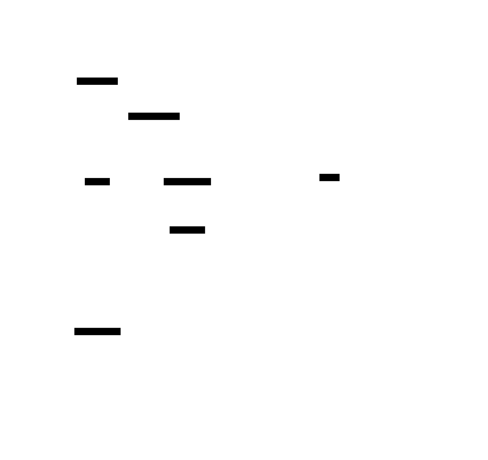
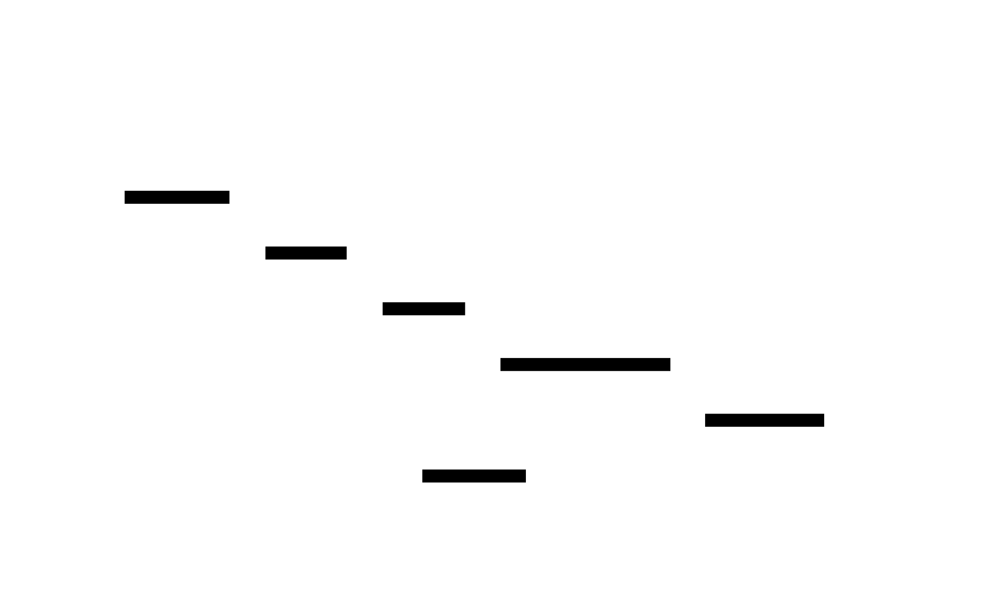

# Architecture

This document describes the architecture of the AI Tax Workflow reference system.

Two views:

- **Structural (what is it)** - layered architecture diagram in [architecture.svg](architecture.svg)
- **Dynamic (how it behaves)** - sequence diagram of return processing in [flow.svg](flow.svg)

---

## Structural View

Source: [`architecture.d2`](architecture.d2)

### Layers

| Layer | Role | Tech |
|-------|------|------|
| Actors | Users of the system | CPA, Firm Admin |
| Presentation | Browser-facing UI | Next.js 15 (App Router) |
| API Gateway | Request routing, auth, audit | FastAPI + Pydantic |
| Extraction Pipeline | Async workers processing returns | Celery + Redis |
| Data | Persistent storage | S3 (encrypted), Postgres, Immutable audit S3, Redis |
| External Services | Third-party APIs | AWS Textract, Anthropic Claude, ProConnect, DrakeTax, Sentry |

### Component Responsibilities

**Presentation**
- Upload Portal: signed-URL drag-and-drop upload for tax returns
- Review Queue UI: side-by-side view of original document and extracted values for human review of low-confidence fields
- Admin Dashboard: queue depth, throughput, audit trails, user management

**API Gateway**
- REST API: all client-facing endpoints, OpenAPI-documented
- Auth Middleware: JWT validation, role-based access control
- Audit Middleware: logs every mutating request to the immutable audit bucket

**Extraction Pipeline**
- Ingest Service: validates uploads, generates signed URLs, enqueues OCR jobs
- OCR Worker: orchestrates AWS Textract, stores raw OCR output, enqueues extraction
- Extraction Worker: calls Claude with PII-redacted prompts, persists fields with per-value confidence scores, routes to review queue or mapping based on threshold
- Mapping Worker: transforms verified fields into ProConnect- or DrakeTax-ready format, handles target-specific quirks in isolated modules (`proconnect.py`, `draketax.py`)

**Data**
- Encrypted S3: client-uploaded PDFs, KMS-managed keys, signed URLs for access
- Postgres: review state, user records, extracted field history
- Immutable Audit Log: append-only S3 bucket for compliance trail
- Redis: Celery broker + short-lived cache

**External**
- AWS Textract: OCR optimized for tax documents, strong on tables
- Anthropic Claude 3.5 Sonnet: structured extraction with zero-retention enabled, PII redacted before any prompt
- ProConnect / DrakeTax APIs: export target
- Sentry: error tracking, incident alerts

---

## Dynamic View

Source: [`flow.d2`](flow.d2)

### Flow Summary

1. **Upload** (steps 1-8): CPA uploads tax return through signed URL, API enqueues OCR job, user sees "processing" confirmation.
2. **OCR** (steps 9-13): Worker extracts text + layout via Textract, stores raw parse, enqueues extraction.
3. **Extraction** (steps 14-18): Worker redacts PII, calls Claude with structured JSON mode, persists all fields with per-value confidence scores.
4. **Confidence branch** (step 19): High-confidence fields bypass review; low-confidence fields enter the review queue.
5. **Human review** (steps 20-24, review path only): CPA inspects doc + extracted value side by side, approves or corrects. Corrections are append-only, never overwrites.
6. **Mapping and export** (steps 25-31): Mapping worker transforms verified fields to target format, pushes to ProConnect or DrakeTax, notifies CPA when ready.

### Error Paths (not shown in diagram)

- **OCR fails or returns garbage**: return flagged "unprocessable", routed to manual-entry queue
- **LLM timeout or rate limit**: exponential backoff retry, fallback to Claude Haiku after 3 failures
- **S3 upload fails**: clear error to user, nothing partial stored
- **Mapping layer rejects a field**: blocks export, surfaces structured error with "fix field" link
- **PII leak risk**: prompts pre-redact SSN/ITIN with reversible tokens; any prompt that would include PII bypasses LLM and goes straight to manual review

---

## Key Design Decisions

### Why confidence scoring + review queue?

A raw LLM call is fast but wrong on messy documents. Confidence scoring makes accuracy *measurable*. Below-threshold fields never reach the target system without a human touching them. Above-threshold fields still get audit-logged so you can retroactively verify if model behavior drifts.

### Why isolate mapping per target?

ProConnect and DrakeTax have different quirks (field names, date formats, enum values). Keeping `proconnect.py` and `draketax.py` as separate modules means a format change in one target never breaks the other. Integration tests run against sample imports nightly.

### Why append-only corrections?

CPAs making review corrections should never be able to corrupt historical data. All corrections carry user ID + timestamp + original value. If a bad correction ships, replay from the audit log.

### Why Celery over serverless?

Tax season has sustained high load (weeks-long spikes), not bursty load. Celery workers autoscale on queue depth cheaper than serverless at this volume, and Redis gives us fine-grained control over retry + DLQ behavior that Lambda/Cloud Run makes harder.
